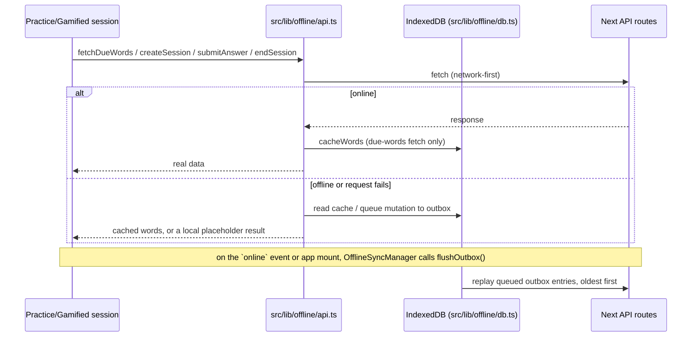

# Hifz (حفظ) — Arabic Vocabulary Memorization App

Production-minded personal vocabulary trainer built with Next.js App Router + TypeScript.

- **Repo:** https://github.com/Manu-world/hifz
- **Live:** https://hifz-lac.vercel.app (gated by `APP_SHARED_SECRET` — see
  [Deploying to Production](#deploying-to-production-vercel--turso))

## Current Status

Implemented and verified:

- Data layer (Prisma + SQLite local, Turso/libSQL production adapter)
- CSV paste import with preview + duplicate handling
- Recall + Reverse practice sessions, with speech-synthesis pronunciation button
- Arabic/English answer normalization + matching
- Leitner-box scheduler ([0, 1, 3, 7, 16, 35] days)
- Session logging + daily streak tracking
- Revise All mode (category-wide review ignoring dueAt/isDone)
- Category management: rename, delete (with confirmation), per-category mastery/due stats on home
- Word list page per category: edit, delete, manual "done" toggle
- App navigation shell (Home / Dashboard / Import), hidden during practice sessions
- Dashboard: streak, XP/level, per-category mastery bars, achievements, 30-day mastered/accuracy charts
- Gamification engine: box-weighted XP, leveling, achievements (first session, 7-day streak, 50 mastered, perfect Word Rush round)
- Gamified Mode: Word Rush (MCQ), Type Sprint (timed recall + combo), Sentence Weaver (fill-the-blank), rotating per word
- JSON data export (full backup: categories, words, progress, sessions, gamification profile)
- Offline-first practice: IndexedDB due-words cache + mutation outbox, synced automatically on
  reconnect (see [Offline & Sync](#offline--sync))
- PWA installability (manifest + icon + service worker with app-shell precache and network-first
  API caching)
- Optional shared-secret gate (`proxy.ts`) for public deployments
- `error.tsx` / `not-found.tsx` boundaries, `loading.tsx` skeletons on every DB-backed route, and a
  mobile-first practice layout

All PRD phases are implemented; see [Known Assumptions](#known-assumptions) for the deliberate
scope trade-offs.

## Tech Stack

- Next.js 16 (App Router), React 19, TypeScript
- Tailwind v4 + shadcn/ui
- Prisma 7 + @prisma/adapter-libsql + @libsql/client
- Zod, PapaParse, date-fns, recharts, idb (offline IndexedDB cache/outbox)
- Vitest for unit tests

## Run Locally

1. Install dependencies:

```bash
pnpm install
```

2. Ensure env files exist (`.env` and `.env.local`) with local DB url:

```bash
DATABASE_URL="file:./dev.db"
```

3. Apply migrations locally:

```bash
pnpm prisma:migrate:dev
```

4. Start dev server:

```bash
pnpm dev
```

## Run In Docker (for phone access)

1. Build the image:

```bash
docker build -t hifz-app .
```

2. Run the container and map port 3000:

```bash
docker run --rm -p 3000:3000 --name hifz-app \
  -e DATABASE_URL="file:./dev.db" \
  hifz-app
```

If you want Turso-backed data instead of an in-container sqlite file, pass:

```bash
-e DATABASE_URL="libsql://<your-db>-<org>.turso.io" \
-e DATABASE_AUTH_TOKEN="<your-token>"
```

3. Expose the container to your phone via ngrok:

```bash
ngrok http --url=fluent-legal-slug.ngrok-free.app 3000
```

4. Open this URL on your phone:

```text
https://fluent-legal-slug.ngrok-free.app/
```

Notes:

- Keep both the Docker container and ngrok process running.
- The service worker registers only in production mode, which is what the container uses.

## Deploying to Production (Vercel + Turso)

1. Create the Turso database:

```bash
turso db create hifz-vocab
turso db tokens create hifz-vocab
```

`turso db tokens create` is the only command that produces a valid `DATABASE_AUTH_TOKEN` —
pasting an account/dashboard access token here instead gets a `401` from libsql at request time,
not at deploy time, so it's easy to miss until you hit `/api/health`.

2. Prisma 7's migrate commands don't target `libsql://` URLs directly (see
   [Critical Operational Notes](#critical-operational-notes)), so replay the local migration SQL
   onto Turso instead:

```bash
cat prisma/migrations/<latest-migration-folder>/migration.sql | turso db shell hifz-vocab
```

3. Import the project into Vercel, then set these environment variables (Project Settings →
   Environment Variables):

| Variable              | Value                                     |
| --------------------- | ----------------------------------------- |
| `DATABASE_URL`        | `libsql://hifz-vocab-<your-org>.turso.io` |
| `DATABASE_AUTH_TOKEN` | token from `turso db tokens create`       |
| `APP_SHARED_SECRET`   | optional — see below                      |

4. Deploy. `pnpm install` runs `prisma generate` automatically via the `postinstall` script, so no
   extra build configuration is needed. Vercel's filesystem is ephemeral/read-only at runtime, so
   `DATABASE_URL` **must** point at Turso in production — there is no local SQLite file to fall
   back to.

5. Optional: set `APP_SHARED_SECRET` to gate the deployment behind a shared secret (see
   [`src/proxy.ts`](src/proxy.ts)). Visit `https://<your-app>.vercel.app/?key=<secret>` once; a
   cookie is set for a year so you don't need to repeat the query param. This is a lightweight
   speed bump for a single-user app on a public URL, not real authentication — leave it unset for
   a private/trusted deployment.

6. Release checklist:

- `pnpm vitest run && pnpm lint && pnpm format:check && pnpm build` all pass locally.
- Smoke test on the production URL: import a CSV, complete a Recall session, play a Gamified
  round, check the dashboard updates, export a backup.
- Offline smoke test: open a category's practice page, then enable airplane mode mid-session,
  answer a few words, finish the session, re-enable networking, and confirm the "Offline" badge
  clears and the answers/session show up (check the dashboard or `/api/export`).
- Install the PWA on your phone from the production URL (Add to Home Screen) and confirm it opens
  standalone.

## Quality Gates

```bash
pnpm vitest run
pnpm lint
pnpm format:check
pnpm build
```

## Route/Feature Map

- `/` category list: mastery/due stats, rename, delete, links into every practice mode + word list
- `/dashboard` streak, XP/level, achievements, category mastery bars, 30-day charts, export backup
- `/import` CSV import flow (new/existing category)
- `/categories/[categoryId]/words` per-category word list: edit, delete, toggle done
- `/practice/[categoryId]?mode=recall|reverse|gamified[&revise=1]` practice session (`revise=1`
  ignored in gamified mode — it always pulls the live due queue)
- `/api/words/due` due/revision queue fetch (`&mode=gamified` also returns the category's word
  pool for Word Rush distractors)
- `/api/progress/answer` scheduler mutation on answer submit (`awardXp`/`speedFraction` for
  Gamified mode)
- `/api/progress/[wordId]/done` manual done toggle
- `/api/sessions` create session log
- `/api/sessions/[id]` close session log, apply XP + achievement checks
- `/api/export` full JSON data backup

## Offline & Sync

Practice sessions (Recall, Reverse, Gamified) work without a network connection. All of it lives
under [`src/lib/offline/`](src/lib/offline/):



- **`db.ts`** — the `idb`-backed schema: a `wordCache` store (last-fetched due-word queue per
  category) and an `outbox` store (pending answers/sessions).
- **`sync.ts`** — cache read/write, outbox queueing, and `flushOutbox()`, which replays entries
  FIFO and stops at the first failure so ordering is preserved for retry.
- **`api.ts`** — drop-in replacements for the raw `fetch()` calls practice components make
  (`fetchDueWords`, `createSession`, `submitAnswer`, `endSession`). Each tries the network first;
  online behavior is unchanged. Only fallback paths touch IndexedDB.
- **`hooks.ts`** — `useOnlineStatus()`, surfaced as an "Offline" badge in the nav bar.
- **`OfflineSyncManager`** (mounted once in `layout.tsx`) flushes the outbox on the `online` event
  and once on mount, so a session finished offline syncs as soon as connectivity returns.
- **Service worker** (`public/sw.js`) precaches the app shell (`/`, `/manifest.webmanifest`) and
  caches `GET /api/words/due` network-first, so the app can open and a session can boot while
  offline even before IndexedDB has anything cached for that category. `/_next/static/*` chunks
  are intentionally not precached — they're hashed per build and there's no build-time manifest
  generator (Workbox/next-pwa) wired up to enumerate them; the browser's HTTP cache handles repeat
  visits well enough for a personal app.

**Known limitations (single-user app, so these are accepted trade-offs, not TODOs):**

- A session started entirely offline never gets a real `SessionLog` id until it syncs — its
  create+end are queued as one combined replay. A session that started online and only lost
  connectivity before closing keeps its real id and only queues the close.
- Per-answer XP (`awardXp`) can't be computed offline (it's box-weighted, and the authoritative box
  lives server-side), so queued answers report `xpEarned: 0` until they sync. If an entire Gamified
  session happens offline, the session's aggregate `xpEarned`/`correctCount` tally sent on close was
  already computed client-side at 0 — the per-word box progression itself is still fully correct
  once synced, just the session-level XP tally undercounts in that specific scenario.
- Conflict policy is last-write-wins on `WordProgress`; outbox entries replay strictly in the order
  they were queued, so this only matters if the same word was also practiced from a second device
  in the meantime — not a realistic scenario for a single-user app.
- Export a JSON backup (see above) before relying on offline mode for extended periods, as a safety
  net against any sync edge case.

## Known Assumptions

- Recall/Reverse sessions award 0 XP; only Gamified Mode grants XP (box-weighted, see
  [`src/lib/practice/gamification.ts`](src/lib/practice/gamification.ts)).
- Any practice mode counts toward the daily streak and toward the `first_session`/`streak_7`
  achievements — these aren't Gamified-only.
- Revise All reuses recall mode semantics with `isRevision=true` in `SessionLog`; Gamified mode
  always pulls the live due queue (no revise-all variant).
- Type Sprint's combo multiplier is a session-ephemeral client-side mechanic, applied on top of
  the server's box-weighted base XP — it isn't persisted between sessions.
- Sentence Weaver falls back to Type Sprint when a word has no example sentence, or when the
  category doesn't have enough other words to build Word Rush's 4 multiple-choice options.

## Critical Operational Notes

- DB-backed pages must export:

```ts
export const dynamic = "force-dynamic";
```

Reason: Prisma calls are not `fetch()`, so Next may otherwise prerender stale build-time data.

- Prisma 7 + Turso migrate limitation:
  - `prisma migrate deploy/dev` does not target `libsql://...` directly.
  - Generate local migration SQL first, then replay to Turso:

```bash
cat prisma/migrations/<name>/migration.sql | turso db shell hifz-vocab
```

- Avoid terminal env leakage in persistent shells:
  - prefer one-shot env prefixing over `source .env.turso.local` in a long-lived session.
- Next.js 16 renamed the `middleware.ts` file convention to `proxy.ts` (`export function proxy`
  instead of `export function middleware`) — see
  `node_modules/next/dist/docs/01-app/03-api-reference/03-file-conventions/proxy.md`. This project
  uses [`src/proxy.ts`](src/proxy.ts) for the optional shared-secret gate.

## Smooth Resume Checklist (Pick Up Later)

All planned PRD phases are implemented. When picking this project back up for new work:

1. Run quality baseline:

```bash
pnpm vitest run && pnpm lint && pnpm format:check && pnpm build
```

2. Re-run quality gates and smoke test the flow you touched (see
   [Deploying to Production](#deploying-to-production-vercel--turso) for the release checklist).
3. Commit with one concern per commit.
